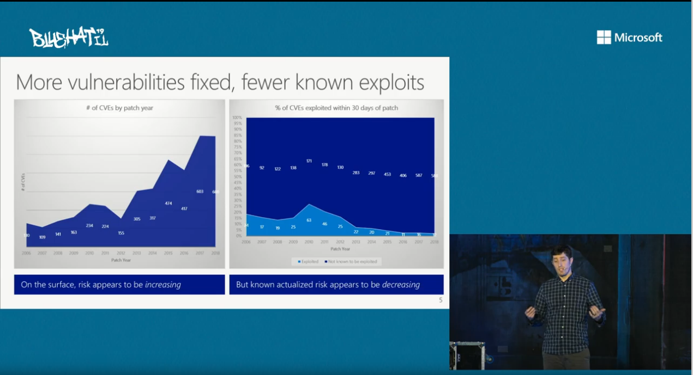
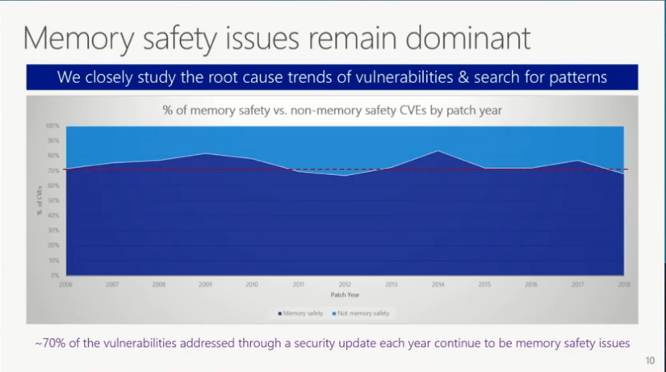
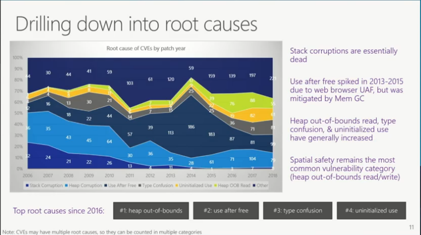
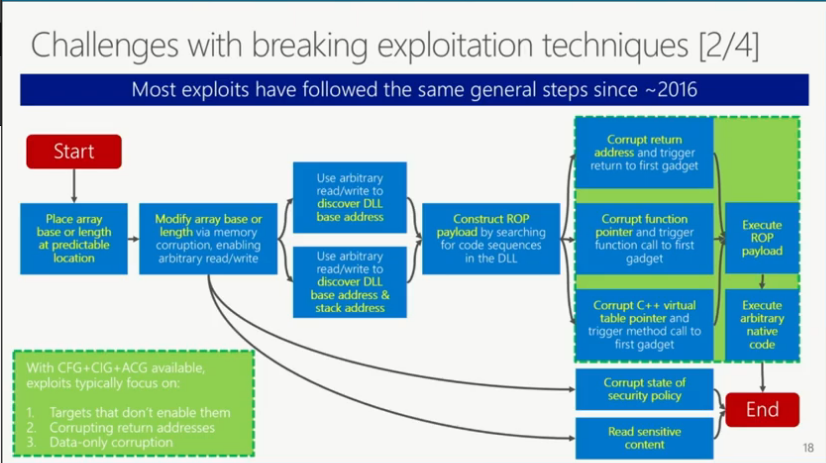

# Attacks Of Today

This is of September 2020.

On the 7th of February, 2019, Matt Miller \(an employee of Microsoft Security Response Center \(MSRC\)\) gave a talk about "_**Trends, challenges, and strategic shifts in the software vulnerability mitigation landscape**_"



He has some amazing graphs show casing many things:

This here is showcasing that over the years, there has been a lot more  risks increasing. However, if we look at the right, there seems to be an actual decrease in the vulnerabilities that are being exploited. This shows that the defence mitigations that we're putting in is actually helping.

He then goes on to talk about the types of exploit, and in particular the exploit vectors that are being leveraged by attacks

As we can see here, there's an average of 70% of exploits which are memory corruption exploits, over the years. He talked a lot about this, as this is the one of the main cuases the applications get exploited.

He then went on to show the most popular attacks with memory corruption

So as we can see here, our basic vanilla stack buffer overflows are "essentially dead", because of stack canaries and things like that. You'll see these types of attacks from time to time in desktop software, and generally in IoT devices, however it's mainly toast.

However, we see that the top causes since 2016 are heap exploits. ~~Does this mean that developers don't know how to properly and securely free there data?~~

He then goes on to show what the step by step instructions are in which attackers have been crafting their exploits

So we can see that we:

1. Place an array base or length at a predicatble location
2. Modify array base or length via memory corruption, enabling arbitrary read/write
3. One path could be:
   1. Corrupt the state of security policy
   2. Read sensitive content
4. Or we could:
   1. Use arbitrary read/write to discover DLL base address
   2. Use arbitrary read/write to discover DLL base address and stack address
5. Construct ROP payload by searching for code sequences in the DLL
6. Either
   1. Corrupt the return address and trigger return to first gadget
   2. Corrupt the function pointer and trigger function call to first gadget
   3. Corrupt C++ virtual table pointer and trigger method call to first gadget
7. We will then execute the ROP payload
8. Which'll execute arbitrary native code and has been exploited

