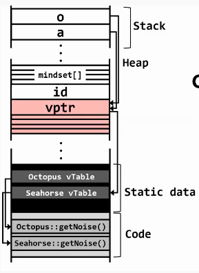

# Heap Feng Shui

\(Following on from [Type Confusion](type-confusion.md)\)

If we look back at the `Octopus` and `Seahorse` example, we can take a look at the virtual address space where an attacker has overflowed the heap



But now that pends the question: How does an attacker position an overflowable buffer directly before an exploitable object?

One method is using _heap feng shui_ \(pronounced "heap feng shway"\)

## Heap Feng Shui

Suppose that the attacker knows some details about the heap allocation. 

* Maybe it's deterministic?
  * If you feed the algorithm the same series of allocation size requests, the heap allocation algorithm will return memory chunks that are in the exact same place modulo ASLR changing the starting base of the heap
* Maybe it uses slab allocation?
  * This is a helpful allocation strategy when you have program that allocates objects of the same size. Before any allocation occurs, the allocator is going to create a big array where each array element is of a particular object element size. So maybe one slab, all four objects of size 32 bytes. Now, when the allocator needs to generate memory for allocate memory request, it can check a bitmap to find the first free slab and then return a pointer to that address to the caller.
* Maybe it allocates large objects on page-aligned offsets, eg. `mmap()` is used to allocate the memory?

What an attacker can do, if they know this, they can place a vulnerable object net to an overflowable object.

## Example

Say that we had a deterministic slab allocator in a program.

1. We assume that no objects have been allocated

```cpp
+-----+-----+-----+-----+-----+-----+-----+-----+-----+-----+-----+-----+
|     |     |     |     |     |     |     |     |     |     |     |     |
+-----+-----+-----+-----+-----+-----+-----+-----+-----+-----+-----+-----+
```

    2. The attacker allocates a bunch of objects, filling the slab

```cpp
+-----+-----+-----+-----+-----+-----+-----+-----+-----+-----+-----+-----+
|#####|#####|#####|#####|#####|#####|#####|#####|#####|#####|#####|#####|
+-----+-----+-----+-----+-----+-----+-----+-----+-----+-----+-----+-----+
```

    3. The attacker deallocates two objects

```cpp
+-----+-----+-----+-----+-----+-----+-----+-----+-----+-----+-----+-----+
|     |     |#####|#####|#####|#####|#####|#####|#####|#####|#####|#####|
+-----+-----+-----+-----+-----+-----+-----+-----+-----+-----+-----+-----+
```

As we're assuming that the slab allocator is deterministic, we assume the attacker knows the positions in which these two new slots are going to appear \(in step 3, the first two\).

    4. The attacker can allocate an overflowable object and then allocate the vulnerable one \(the one they want to corrupt\)

```cpp
+-----+-----+-----+-----+-----+-----+-----+-----+-----+-----+-----+-----+
|_____|$$$$$|#####|#####|#####|#####|#####|#####|#####|#####|#####|#####|
+-----+-----+-----+-----+-----+-----+-----+-----+-----+-----+-----+-----+
```

The overflowable buffer is signified as `_`, the vulnerable one is signified with `$`.

    5. The attacker can then overflow the overflowable object as well as the vulnerable one

```cpp
+-----+-----+-----+-----+-----+-----+-----+-----+-----+-----+-----+-----+
|_________$$|#####|#####|#####|#####|#####|#####|#####|#####|#####|#####|
+-----+-----+-----+-----+-----+-----+-----+-----+-----+-----+-----+-----+
```

