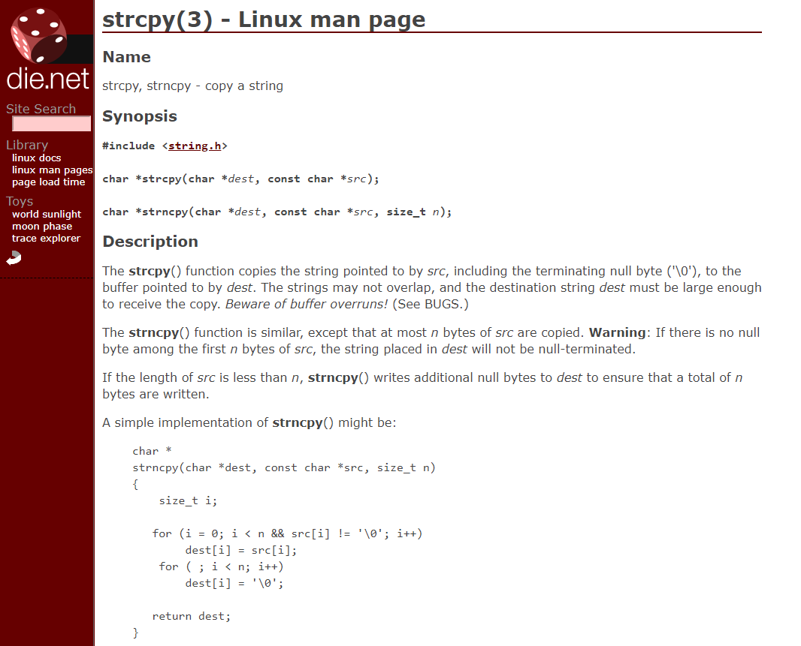
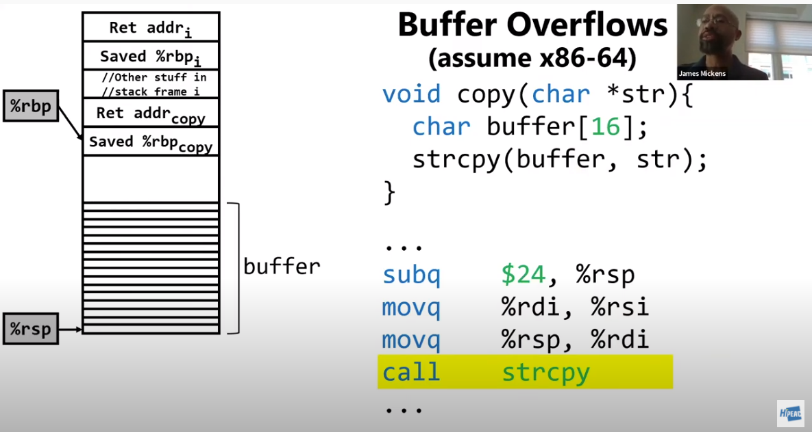
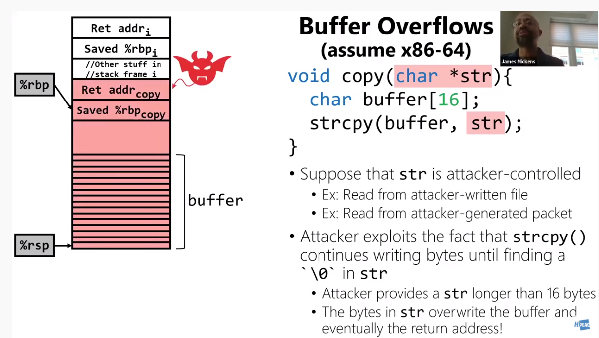

# Buffer Overflows \(BOFs\)

Let's jump in with an example, using an x86-64 program.

## Example

```c
void copy(char *str) {
    char buffer [16];
    strcpy(buffer, str)
}
```

Here we have part of a program, in which main calls this function.

Now, let's have a look at the man page for what `strcpy` does.



So we see that it copies a string to a destination. Easy. However, when we read all the way through it, we see 

> **Warning:**  If there is no null byte among the first _n_  bytes of src, the string placed in dest will not be null-terminated

So what does this mean? Well, in C when we provide a string, it actually pads it with a null byte at the end to tell functions, such as `strcpy`, that that is the end of the string. The compiler would do this automatically.

This is how the assembly and the stack may look like for a call to `strcpy`



If we suppose that that `str` is attacker-controlled \(in our example\), and we intend to exploit this program, then we can provide more than 16 bytes of memory and `strcpy` will still copy those bytes to `buffer`. But hold on. Where will the data be saved to? Well, that'll end up on the stack.

What we are doing here is known as "overflowing the buffer", which quite literally is overflowing the buffer, that is _16_ in our example, and then providing more input. This will then end up on the stack, and we can get all the way up to the return address of the stack frame. We can then provide our own return address, and pivot to that location! 



So, what can we do from there? Well, there's many things, such as providing our own _shellcode_ to allow us to gain a shell as the user that is running the program

