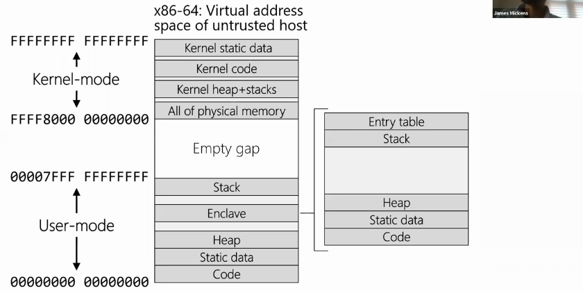
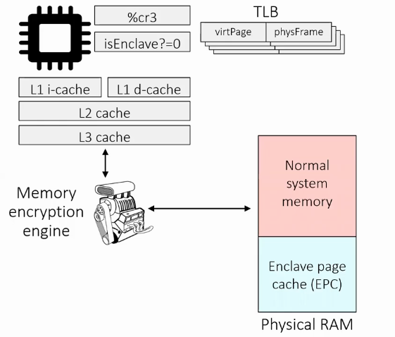

# SGX

## Software Guard Extension

### Overview

* Goal 1: allow a client to interact with a secure-side computation
  * We assume that this is a data-centre scenario
  * We assume that the OS and data-centre operator are untrusted with respect to the client that wants to interact with some server-side computation
  * We want to prevent both the OS on the data-centre machine, and the data-centre operator themselves, from reading or tampering with the state of the server-side computation without being detected
* Goal 2: Allow the secure computation to execute atop the highly-optimsed circuits which execute traditional computations
  * The architects at Intel took a lot of time to make the microarchitecture fast, so ideally we would like this secure server-side computation to run the greatest extent possible on those highly-optimised circuits that do things like speculative execution and out-of-order execution etc
  * Hmmm, this raises the problem of side-channels. If we're not going to have a separate chip that's going to execute this secure computation then presumably this means there's going to be some sharing, if only at the microarchitecture level
  * There's also this big challenge of adding a minimal set of SGX hardware components to a complicated legacy microarchitecture?
  * 

### Enclave

So if we look at a 64 bit virtual address space, we have the normal things. However, we're going to add an _enclave_ to the user-mode state which is going to be the secure computation



In the enclave, we're going to have:

* stack
* heap
* static data
* code
* Entry table
  * help to coordinate how external code jumps or invokes enclave functionality

As the diagram suggests, there's going to be this untrusted host process which embeds an enclave. When code in the untrusted process is executing \(in the user-mode state\), it can't access the enclave pages. If you try to read, you're going to get the value of `-1`, regardless of the state of the enclave pages. If you try to write to the enclave pages, the hardware just drops those writes.

The untrusted host interacts with the enclave code using an `EENTER` instruction, which basically says "hey, I'm the untrusted host, I want to start enclave code."

The enclave code is going to run at ring-3, the least-privileged level. However, the enclave code can access the entire user-mode address space of the host. This is helpful, as it turns out, the enclave code can't issue system calls instructions, such as `syscall` or `int`. If the enclave code wants to issue I/Os, it has to rely on the untrusted host.

For example, if the if the enclave wants to write data to the disk or network, it has to place that data somewhere in the memory that's accessible to the untrusted host, and hope that the untrusted hist will perform the write. Similarly, if the enclave wants to read data in, then it has to put that data request in somewhere in the memory accessible to the untrusted host, then ask the untrusted host to issue the I/O, then read that result in from the untrusted memory.

The enclave can return the control of the CPU back to the untrusted host by executing this new `EEXIT` instruction.

### Microarchitecture



So when we look at normal microarchitecture, we see that we've got a core alongside some L1, L2 and L3 cache. We've got the page table register \(`%cr3` which we looked at in [NX + page tables](nx.md)\). It's going to have a bunch of Translation Lookaside Buffers  \(TLBs\) that control the mappings from virtual mappings to physical ones.

We're then going to add this special `isEnclave` bit. This can be thought of as being similar to the logical `isPrivelleged` bit that the CPU has, which is set for whether the code is running in the kernel-mode or in user-mode. So therefore, we can say that the `isEnclave` bit is asking whether were running enclave code or not.

In between a core and it's memory holding and the physical RAM, there's a Memory Encryption Engine. Using this, we can separate physical RAM into two separate regions: normal system memory and enclave page cache \(EPC\), which is where all the enclave state lives.

What the MEE is going to do is, when enclave code is running, and an enclave own cache line has to be evicted from the L3, it's going to transparently encrypt that thing and add some max counters, before sending that memory write to the physical RAM. This means that for all of the EPC state, all the enclave page state, it's all encrypted. Even if you were to use EE tricks and try and read the RAM directly, it's all encrypted by the Memory Encryption Engine, before it even hits the bus which goes to physical RAM. So it's safe against physical tampering.

When enclave code is executing, and it needs to bring in enclave data from physical RAM, from L1 through to L3 cache, then as that cache line is coming from physical RAM, it's going to go through the Memory Encryption Engine, which is going to decrypt the data and check the counters and the MAC to look for integrity and freshness.

What's not in the diagram is this new hardware base data structure called the Enclave Page Cache Map \(EPCM\). This is an SGX structure that's going to contain 1 entry for each page in the EPC. The EPCM can only be modified by SGX instructions, which means that the EPC is going to contain a lot of important metadata like which particular EPC belongs to the EPCM. The EPCM is also consulted during memory accesses to prevent EPC pages from being read or written to by people who shouldn't be able to write there.

What bits do we have in the Enclave Page Cache Map?

```cpp
+----------+-------------------+---+------------------------+-------------+------------+
| Valid ?  | Owning enclave id |   | base virt addr of page | r/w/x perms | Blocked?  |
+---+-----------+---+-----------+-----+---+
```


