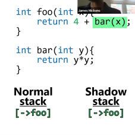
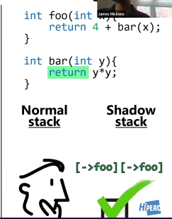

# Defence: Shadow stacks \(Intel CET\)

## Intel's CET

### What is it?

It stands for **Intel Control-Flow Enforcement Technology**, and it ships with:

* Tiger Lake chips that are coming out in 2021
* Upcoming Xeon chips

One thing that Intel's CET provides is this notion of a shadow stack. The shadow stacks are a separate, hardware managed stack which traces `call` and `ret` info.

The basic idea is pretty simple:

* During a `call` instruction, the **hardware itself**, not the OS, is going to `push` the address of the instruction after the call onto the shadow stack.

  * The reason that it's the address after the `call` is because that's where the function should return to



* During a `ret` instruction, **the hardware** again is going to `pop` the addresses from the shadow stack **and** the regular stack, and is going to check to see whether they match. 
  * If they don't match, then the CPU will raise a Control Protection Exception, and then OS terminates the process



### Where do Shadow stacks live?

Intel's implementation of CET, the shadow stack lives in virtual memory. You don't have to implement the shadow stack like this. You could imagine that the shadow stack live in some sort of hardware buffer, that isn't part of the virtual memory space, and that is only used for shadow stack stuff.

### Well if it lives in virtual memory, can it be attacked?

As it turns out, Intel has figured this out that an attacker can try and tamper with it, so the CET protects the shadow stack using page table protection. By setting the protections correct on the shadow stack means that the only instructions that can modify the shadow stack are the `call` and the `ret.`However, there are some other instructions that can manipulate the shadow stack: `saveprevssp` and `rstoressp`:

* Save and restore a shadow stack pointer
* Useful for context-switching between shadow stacks

`incssp`

* Remove shadow stack entries with no `ret`

  * There are some situations where userland code needs to do some non-local returns, ie. returns that don't correspond to return addresses on the stack
  * Common example is Language-level exception handling
    * `try .. catch` blocks
  * When we implement these, we get to do what's called _unwinding the stack._
  * Often, you would unwind the stack which would otherwise seem unnatural

### How can it be implemented?

```text
$ gcc -fcf-protection -o out program.c
```

`-fcf-protection` has a couple of levels:

* `-fcf-protection=branch`: tells compiler to implement checking of validity of control-flow transfer at the point of indirect branch instructions, ie. `call/jmp` instructions
* `-fcf-protection=return`: implements checking of validity at the point of returning from a  function
* `-fcf-protection=full`: an alias for specifying both "branch" and "return"
* `-fcf-protection=none`: turns off instrumentation

