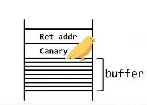

# Defence: Stack Canaries

## What are they?

They are essentially a value that gets set at the start of a function, and then checked at the end of a function to see if that value has been changed.

If it has been changed, then the application would throw a fit, calling `__stack_chk_fail()` and saying that it's detected a buffer overflow, therefore terminating the program.

You can think of them as like a canary bird, which is known as a _sentinel species_ \(organisms that detect danger\). Canaries were used in coal mines to detect whether there was any carbon monoxide in the mines \(a colourless, odourless, tasteless, toxic gas\). If there was, then the canary would have inhaled the CO before the miners, therefore allowing the miners to get out before it was too late.

To put this into terms of the stack, a canary is sent in to stay idle in the stack frame. If it inhales a buffer overflow, then it'll provide a warning to the application that the canary isn't there any more, therefore resulting in a buffer overflow. The application knows that there's a danger, so it'll terminate.

## How do they work?

The base idea is that you want to place a special value in memory, between a stack frame's local variables and a memory location to protect \(eg. the frame's return address\). Immediately before the function returns, the application, **not the OS or hardware**, checks whether that canary value has been changed.

A buffer overflow that tramples a return address will trample the canary as well



## So how can it be implemented?

The developer doesn't have to worry about coding it in. If they did, then they might not implement the stack canary correctly, or in all the places where it's needed. This is where the compiler comes in:

```bash
$ gcc -fstack-protector -o out program.c
```

There are three types of modes when compiling:

* `-fstack-protector` \(since GCC4.1\): includes a canary when a function defines and array of `char` with a size of 8 bytes or more
* `-fstack-protector-all`: adds a canary for all non-inline functions
* `-fstack-protector-strong`: \(since 4.9\): provides a smarter way to protect any sensitive location within the current context

And this is what they will look like in assembly and C \(when decompiled\):



```text
push rbp
mov rbp, rsp
sub rsp, 0x410
mov rax, qword ptr fs:[0x28] ; read the canary into fs:[0x28]
mov qword ptr [rbp - 8], rax ; push it onto the stack
xor rax, rax                 ; zero out the rax so that it can't be seen again

...

mov rax, qword ptr fs:[0x28] ; move the SC into rax
cmp rax, qword ptr [rbp - 8] ; if rax isn't equal to the SC
jne 0x804859e                ; any old address
add rsp, 0x410
ret
call 0x80483b0                ; call __stack_chk_fail@plt (the jump from the jne)
```



```
mov %rsp, %rbp
sub 0x410, %rsp
mov %fs:(0x28), %rax     ; read the canary into fs:[0x28]
mov %rax, -0x8(%rbp)     ; push it onto the stack
xor %rax, %rax           ; zero out the rax so it can't be read

...

mov -0x8(%rbp), %rax     ; move the canary value into rax
xor %fs:(0x28), %rax     ; if equal, should be 0
je codeToFuncReturn
call __stack_chk_fail    ; detected buffer overflow
```



```c
undefined8 main(void)
{
    int64_t inFS_OFFSET;
    
    canary = *(int64_t *)(in_FS_OFFSET+ 0x28);
    ... // code here
    if (canary != *(int64_t *)(in_FS_OFFSET+ 0x28)) {
        __stack_chk_fail();
    }
    return 0;
}
```




